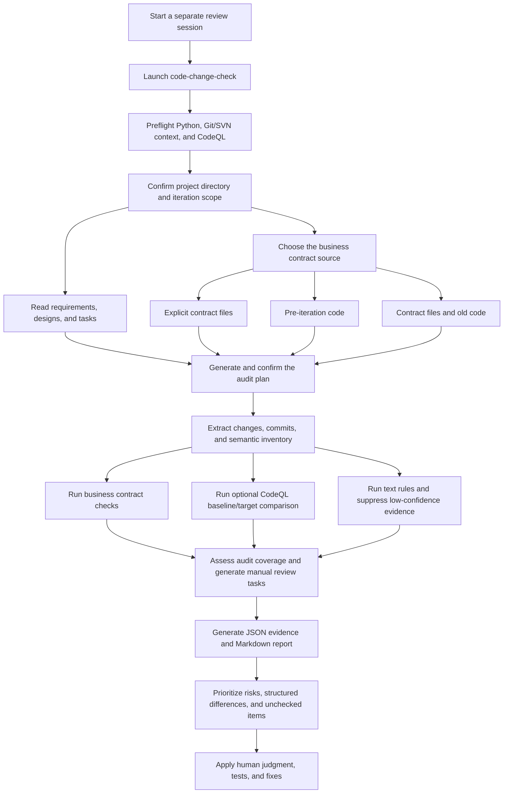

# code-change-check

English | [Simplified Chinese](README.md)

`code-change-check` is a Skill/CLI for reviewing code-change quality in AI-assisted development.

It is not just a `git diff` reader. It brings iteration scope, requirements, task lists, business contracts, semantic differences, and optional CodeQL analysis into one review workflow, so you can find issues where the code runs and the syntax is valid, but a small piece of business logic is wrong.

Typical problems include:

- AI changes an internal service call to a public or external address.
- A third-party integration misses a parameter, passes the wrong field, or changes argument order.
- New code bypasses existing `Client`, `Service`, `Helper`, or `Adapter` conventions.
- Tenant fields, state fields, or permission clues disappear during a change.
- Requirements, tasks, and commits do not line up.
- CodeQL findings are hard to separate into new issues, existing issues, and resolved issues.

## Core Features

- Supports Git, SVN, directory snapshots, and current working-tree scans.
- Supports interactive selection of iteration commits with arrow keys, space for multi-select, and enter to submit.
- Supports OpenSpec, spec-kit, superpowers, Markdown requirements, design documents, and todo documents.
- Maps requirements to commits and exposes commits without requirement sources, plus requirements without commits.
- Extracts candidate business contracts from explicit contract files or pre-iteration code.
- Executes business contract checks. The first supported contract types cover addressing, call arguments, tenant fields, and state fields.
- Extracts JSON response contract paths and compares them with explicit response snapshots.
- Moves text matches from tests, docs, debug logs, fixtures, and XML namespaces into a suppressed evidence section by default.
- Compares lightweight semantic inventories, so some business semantic changes can still be detected when CodeQL is unavailable.
- Optionally runs CodeQL baseline/target comparison and classifies CodeQL findings as new, existing, or resolved.
- Outputs a JSON evidence bundle and a Markdown audit report.
- Can be used as a Skill/rules package for Claude Code, Codex, and Cline.

## Recent Highlights

- **Confirmed audit plans**: lock the project directory, iteration scope, requirement documents, contract source, and CodeQL options before execution. Any parameter change requires reconfirmation.
- **Git/SVN context preflight**: identifies the relationship between the current directory and the Git/SVN working-copy root, reducing scope mistakes when started from an SVN subdirectory.
- **Structured JSON contract checks**: compare field paths and stable `label` values between expected contracts and actual responses.
- **Unchecked is not passed**: missing response snapshots, non-executable contracts, and unavailable CodeQL runs are reported explicitly instead of being treated as successful.
- **Risk noise suppression without losing evidence**: text matches from tests, docs, debug logs, and fixtures move to a suppressed evidence section by default while remaining in the JSON evidence bundle.
- **Baseline/target comparison**: CodeQL and lightweight semantic analysis focus on before/after differences to separate new, existing, and resolved issues.
- **Audit coverage quality gate**: detects zero contract coverage, referenced-but-missing JSON contracts, expected/actual input role conflicts, full scans without a baseline, and incomplete CodeQL analysis so weak evidence is not mistaken for a pass.
- **Code lookup for unchecked contracts**: converts non-executable natural-language contracts into mandatory manual review tasks and locates candidate implementations from endpoint, method, and field identifiers.

## When To Use It

Use this tool when:

- AI generated a large amount of code and you do not want to inspect every line first.
- One iteration contains multiple commits and you need to choose the real review scope.
- Your projects may use Git or SVN.
- Requirements come from OpenSpec, spec-kit, superpowers, or plain Markdown.
- Your system has implicit rules such as internal addressing, tenant isolation, state transitions, or third-party parameter contracts.
- You want to extract existing call shapes from old code as candidate contracts, then confirm which ones should be used as review standards.

## Requirements

- Python 3.10 or later.
- Windows, macOS, or Linux.
- Git or SVN is optional. Without version control, use directory snapshots.
- CodeQL is optional. If CodeQL CLI is not installed, the tool reports that clearly and falls back to non-CodeQL checks.

The launchers detect Python automatically:

- Windows: checks `python` and `py -3`.
- macOS/Linux: checks `python3` and `python`.

If Python 3.10+ is not available, the launcher prints an installation hint.

## Installation

### Option 1: Use It As A CLI

Clone the repository:

```bash
git clone https://github.com/jiaheng6/code-change-check.git
```

If the repository is still private, your GitHub account must have access.

Enter the repository:

```bash
cd code-change-check
```

Call the launcher from the project you want to review.

Windows:

```cmd
path\to\code-change-check\run-code-change-check.cmd --project . --output code-change-check-output
```

PowerShell:

```powershell
powershell -ExecutionPolicy Bypass -File path\to\code-change-check\run-code-change-check.ps1 --project . --output code-change-check-output
```

macOS/Linux:

```bash
sh /path/to/code-change-check/run-code-change-check.sh --project . --output code-change-check-output
```

### Option 2: Install As A Codex Skill

Put this repository under the Codex skills directory, for example:

```text
~/.codex/skills/code-change-check/
```

Keep `SKILL.md` at the root of the directory.

### Option 3: Install As A Claude Code Skill

Put this repository under the Claude skills directory, for example:

```text
~/.claude/skills/code-change-check/
```

When triggered through `/code-change-check` in Claude Code, the shell is usually not an interactive TTY. Do not rely on arrow-key CLI interaction in that environment. The skill should run a preflight check and ask in chat:

- whether to review the current directory or the Git/SVN working-copy root;
- which Git commits or SVN revisions belong to this iteration;
- which business contract source to use;
- whether CodeQL should be enabled, and whether to show setup instructions when CodeQL CLI is missing.

After confirmation, run the check with `--no-interactive` and explicit arguments.

### Option 4: Import With CC Switch

If you use CC Switch, download this project as a ZIP file and import it directly into CC Switch to install it as a Skill. No manual directory copy is required.

Before importing, make sure the extracted ZIP root contains `SKILL.md` directly instead of placing it under an unrelated extra directory.

### Option 5: Use With Cline

Copy the Cline adapter into your target project:

```text
<project>/.clinerules/code-change-check.md
```

Source file:

```text
adapters/cline/code-change-check.md
```

## Use A Separate Review Session

After completing an implementation iteration, start a new Claude Code or Codex conversation before running `code-change-check`.

A separate review session:

- reduces the chance that the reviewer inherits design assumptions, implementation explanations, and self-justification from the original development conversation;
- keeps review evidence, reports, and investigation details from consuming the original development context.

The review session should still access the same project directory, but it should treat requirements, designs, tasks, iteration scope, and contracts as inputs to verify rather than conclusions to trust.

## Workflow



## Quick Start

Run this from the target project:

```bash
path/to/code-change-check/run-code-change-check.cmd --project . --output code-change-check-output
```

When you use the root launchers, or run the Python script directly in a real terminal, the tool enters the interactive wizard by default if you did not explicitly pass change-scope options such as `--base-ref`, `--svn-revision`, `--baseline`, or `--scan-all`. It asks for the change scope, business contract source, and whether CodeQL should be enabled. For CI, pipes, or scripted automation, pass `--no-interactive`.

The output directory contains:

```text
code-change-check-output/code-change-check-evidence.json
code-change-check-output/code-change-check-report.md
```

Read the Markdown report first. Use the JSON evidence bundle for automation or further AI-assisted analysis.

## Common Commands

### Interactive Commit Selection

```bash
path/to/code-change-check/run-code-change-check.cmd --project . --interactive --output code-change-check-output
```

Interactive mode supports:

- Arrow keys to move.
- Space to select or unselect.
- Enter to submit.
- `q` to cancel.

The root `.cmd`, `.ps1`, and `.sh` launchers automatically add `--interactive` when no explicit change scope is supplied. If you run `python scripts/code_change_check.py` directly in a real terminal, the main script follows the same rule; non-TTY environments do not.

### Non-Interactive Mode

```bash
path/to/code-change-check/run-code-change-check.cmd --project . --no-interactive --output code-change-check-output
```

Non-interactive mode is intended for CI, scripted automation, or runs where the scope and options are already known. It does not ask for change scope, contract source, or CodeQL enablement.

### Print Project Context

```bash
path/to/code-change-check/run-code-change-check.cmd --project . --print-context
```

This prints JSON only and does not generate a report. Claude Code, Cline, and other non-TTY environments should use it first to detect the Git/SVN root. If the current directory is an SVN working-copy subdirectory, ask whether to review the current subdirectory or the SVN working-copy root.

If the output contains `vcs=svn-incompatible`, SVN metadata was found but the current SVN client cannot read the working copy. The tool will not silently fall back; continue only after explicitly selecting `--scan-all` or providing `--baseline`.

### Use A Confirmed Audit Plan

For non-TTY environments, generate, confirm, and execute an audit plan:

```bash
path/to/code-change-check/run-code-change-check.cmd --project backend --spec ../openspec/changes/change-a --strict-spec --contract ../docs/contracts --strict-contract --contract-source file --scan-all --codeql --no-interactive --output code-change-check-output --save-audit-plan code-change-check-audit-plan.json
path/to/code-change-check/run-code-change-check.cmd --confirm-audit-plan code-change-check-audit-plan.json
path/to/code-change-check/run-code-change-check.cmd --audit-plan code-change-check-audit-plan.json
```

Unconfirmed plans are rejected. Any parameter change after confirmation requires the plan to be confirmed again. The evidence bundle and Markdown report record the plan path, confirmation status, and effective arguments.

`--spec` and `--contract` accept files or directories. With `--strict-spec` and `--strict-contract`, only explicitly supplied inputs are used.

### Review A Git Range

```bash
path/to/code-change-check/run-code-change-check.cmd --project . --base-ref main --target-ref HEAD --output code-change-check-output
```

### Review An SVN Revision Range

```bash
path/to/code-change-check/run-code-change-check.cmd --project . --svn-revision 100:120 --output code-change-check-output
```

### Compare Two Directory Snapshots

```bash
path/to/code-change-check/run-code-change-check.cmd --project after --baseline before --output code-change-check-output
```

### Provide Requirement Or Task Documents

```bash
path/to/code-change-check/run-code-change-check.cmd --project . --spec docs/spec.md --spec tasks.md --output code-change-check-output
```

### Run Business Contract Checks From A Contract File

```bash
path/to/code-change-check/run-code-change-check.cmd --project . --contract docs/contracts.md --contract-source file --output code-change-check-output
```

### Compare A JSON Contract With An Actual Response Snapshot

Use the same filename for the expected contract and actual response. The comparison checks field paths and stable, unique `label` strings:

```bash
path/to/code-change-check/run-code-change-check.cmd --project . --contract docs/api-contracts/safetyInspection.json --strict-contract --contract-source file --response-snapshot responses/safetyInspection.json --output code-change-check-output
```

Without a matching response snapshot, the JSON contract is reported as unchecked instead of implying that zero violations means it passed.

Expected contract JSON and actual response snapshots have different roles. Do not pass the same file, or an identical copy, to both `--contract` and `--response-snapshot`; the tool rejects the comparison and marks audit coverage as `blocked`.

### Include Support-File Text Findings

Text-rule matches from tests, docs, debug logs, fixtures, contract/response JSON, and XML namespaces remain in `suppressed_findings` by default. Include them in primary findings with:

```bash
path/to/code-change-check/run-code-change-check.cmd --project . --scan-all --include-support-findings --output code-change-check-output
```

### Extract Candidate Contracts From Pre-Iteration Code

```bash
path/to/code-change-check/run-code-change-check.cmd --project . --base-ref main --target-ref HEAD --contract-source existing-code --output code-change-check-output
```

### Use Both Contract Files And Existing Code

```bash
path/to/code-change-check/run-code-change-check.cmd --project . --contract docs/contracts.md --contract-source both --confirm-contracts --output code-change-check-output
```

### Enable CodeQL

```bash
path/to/code-change-check/run-code-change-check.cmd --project . --codeql --output code-change-check-output
```

Require CodeQL to complete successfully:

```bash
path/to/code-change-check/run-code-change-check.cmd --project . --require-codeql --output code-change-check-output
```

Require CodeQL baseline/target comparison to complete successfully:

```bash
path/to/code-change-check/run-code-change-check.cmd --project . --require-codeql-compare --output code-change-check-output
```

## Business Contract Checks

Business contracts can come from:

- Explicit contract files, such as `docs/contracts.md`.
- Candidate contracts extracted from pre-iteration code.

Currently executable contract types:

- `addressing`: checks `internalBaseUrl`, `publicBaseUrl`, and related addressing conventions.
- `call-shape`: checks argument counts and known argument clues for `Client`, `Service`, `Helper`, and `Adapter` calls.
- `tenant`: checks tenant field clues such as `tenantId` and `tenant_id`.
- `state`: checks state field clues such as `status` and `state`.
- `text-rule`: executes text rules that can be parsed into the supported categories above. Other text rules remain manual review clues.
- `json-shape`: extracts JSON field paths and stable `label` strings, then checks missing paths and label changes when a same-name `--response-snapshot` is supplied.

Contracts extracted from old code are only candidate standards. In interactive mode, confirm the candidates before using them, so historical bad code does not become the rule by accident.

The report separates total contracts, checked contracts, unchecked contracts, and structured differences. Unchecked contracts are not counted as passed.

## CodeQL Analysis

CodeQL is optional.

When enabled, the tool tries to:

- Detect CodeQL CLI and available languages.
- Materialize baseline and target source states.
- Create or reuse CodeQL databases.
- Run standard code-scanning query suites.
- Run built-in custom semantic queries.
- Classify findings as new, existing, or resolved.

If CodeQL CLI is not installed, the report shows `unavailable` and the rest of the checks continue.

In interactive mode, if the user enables CodeQL but CodeQL CLI is not installed, the tool asks whether to show installation instructions and prints the official setup link. After installation, make sure `codeql version` works, then rerun the check.

## Report Contents

The Markdown report includes:

- Overview and risk statistics.
- Changed files.
- Selected iteration commits.
- Requirement-to-commit mapping.
- Business contract source, enabled contracts, and execution results.
- Unchecked contracts and structured contract differences.
- Primary findings and suppressed text evidence statistics.
- CodeQL status and baseline/target comparison.
- Business semantic differences.
- Priority manual reading list.
- Detailed findings.
- Suggested verification steps.

The JSON evidence bundle contains the complete structured data and is suitable for scripts or follow-up AI analysis.

## Glossary

| Term | Meaning |
| --- | --- |
| Iteration scope | The exact code-change boundary under review: selected Git commits, an SVN revision range, two directory snapshots, or explicitly selected working-tree changes. |
| Business contract | A business or integration rule that code must preserve, such as internal addressing, required third-party arguments, or required response fields. It includes both explicit protocols and stable implicit conventions. |
| Candidate contract | A possible business rule extracted from pre-iteration code. It requires human confirmation so historical defects do not become standards. |
| Contract source | Where review standards come from: explicit contract files, pre-iteration code, or both. |
| Baseline / target | The state before the iteration and the state being reviewed. Comparing them separates new, existing, and resolved issues. |
| CodeQL | GitHub's semantic code analysis engine. It builds a queryable code database to find cross-function, cross-file data-flow and security issues. This tool uses it as an optional deep-analysis layer. |
| Evidence | Traceable information supporting an audit conclusion, such as changed files, code locations, rule matches, contract differences, commits, or CodeQL results. |
| Primary finding | A high-value clue that should be reviewed first. It is a review lead, not automatically a confirmed defect. |
| Suppressed finding | A lower-confidence text match from support files such as tests, docs, debug logs, or fixtures. It stays in the evidence bundle but does not mix with primary findings by default. |
| Unchecked contract | A recognized contract that could not be verified because inputs or execution support were missing. Unchecked does not mean passed. |
| Response snapshot | An actual JSON response sample used to compare field paths and stable values with a JSON response contract. |
| Semantic inventory / difference | Structured clues extracted from code, such as calls, addressing, fields, and states, plus their before/after changes. |
| Audit plan | The locked set of execution inputs, including project directory, iteration scope, requirements, contract source, and CodeQL options. Parameter changes require reconfirmation. |
| Audit coverage quality gate | A judgment of whether the available evidence can support the conclusion. `blocked` forbids merge recommendations or no-risk claims; `partial` requires explicit coverage limitations. |
| Manual review obligation | A task generated for a contract that cannot be executed automatically, including its source, reason, lookup identifiers, and candidate code locations. |

## How It Differs From A Diff Reader

`code-change-check` does not replace human review. It reduces the cost of entering a review.

It concentrates high-risk clues first, especially problems that usually do not show up as syntax errors or runtime errors:

- Missing, dropped, or reordered parameters.
- Internal and external addressing mix-ups.
- Existing call conventions bypassed.
- Tenant isolation, state fields, or permission clues removed.
- Requirements, tasks, and commits not traceable to each other.

Final decisions still require business knowledge, tests, and human judgment.

## Development Checks

Run all tests:

```bash
python -m unittest discover -s tests -p "test_*.py"
```

Compile scripts:

```bash
python -m py_compile scripts/audit_coverage.py scripts/audit_plan.py scripts/finding_filter.py scripts/code_change_check.py scripts/codeql_support.py scripts/codeql_comparison.py scripts/semantic_inventory.py scripts/codeql_semantic.py scripts/contract_rules.py
```

Validate the Skill:

```bash
py -3 path\to\skill-creator\scripts\quick_validate.py path\to\code-change-check
```

## Keywords

AI code review, AI coding, code audit, static analysis, semantic diff, business contracts, CodeQL, OpenSpec, spec-kit, superpowers, Claude Code, Codex, Cline, Git, SVN.
