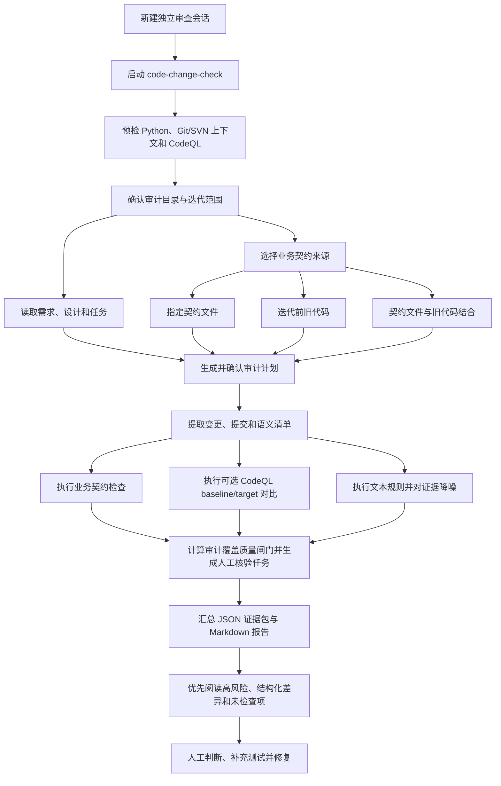

# code-change-check

[English](README.en.md) | 简体中文

`code-change-check` 是一个面向 AI 编程迭代的代码变更质量检查 Skill/CLI。

它不是普通的 `git diff` 阅读器，而是把一次迭代里的提交范围、需求文档、任务列表、业务契约、语义差异和可选 CodeQL 分析放到同一个审计流程里，帮助你更快发现“代码能跑、语法也对，但业务理解错了一小块”的问题。

典型问题包括：

- AI 把内部服务调用改成了外部地址。
- 第三方接口少传、错传或改了参数顺序。
- 新代码绕过了旧的 `Client`、`Service`、`Helper`、`Adapter` 约定。
- 租户字段、状态字段、权限线索在改动中丢失。
- 需求、设计、任务和实际提交对不上。
- CodeQL 命中无法区分新增问题、历史已有问题和已消失问题。

## 核心能力

- 支持 Git、SVN、目录快照和当前工作区扫描。
- 支持交互式选择一次迭代包含的提交记录，空格多选，回车提交。
- 支持 OpenSpec、spec-kit、superpowers、Markdown 需求、设计和 todo 文档。
- 支持需求和提交映射，暴露无需求来源的提交、无提交落地的需求。
- 支持从契约文件或迭代前旧代码提取候选业务契约。
- 支持业务契约执行检查，首批覆盖寻址、调用参数、租户字段和状态字段。
- 支持 JSON 响应契约字段路径提取，并通过实际响应快照执行结构化差异检查。
- 默认把测试、文档、调试日志、fixture 和 XML namespace 文本命中移入已抑制线索区，避免淹没生产风险。
- 支持轻量语义清单对比，CodeQL 不可用时也能发现一部分业务语义变化。
- 支持可选 CodeQL baseline/target 对比，区分新增、已有和已消失的 CodeQL 命中。
- 输出 JSON 证据包和 Markdown 审计报告。
- 可作为 Claude Code、Codex、Cline 的 Skill/规则包使用。

## 近期亮点

- **确认式审计计划**：先确认审计目录、迭代范围、需求文档、契约来源和 CodeQL 选项，再执行检查；参数发生变化后必须重新确认，避免 AI 自行扩大或改变审计范围。
- **Git/SVN 上下文预检**：能够识别当前目录与 Git/SVN 工作副本根目录的关系，降低在 SVN 子目录中误判项目范围的风险。
- **结构化 JSON 契约检查**：对比契约与实际响应的字段路径及稳定 `label` 值，能够发现字段缺失、结构变化和错误文案。
- **明确区分“未检查”和“通过”**：缺少实际响应快照、无法执行的契约或不可用的 CodeQL 不会被当作通过。
- **风险降噪但不丢证据**：测试、文档、调试日志和 fixture 中的文本命中默认移入已抑制线索区，生产风险更突出，原始证据仍保留在 JSON 证据包中。
- **baseline/target 对比**：CodeQL 和轻量语义分析都关注迭代前后差异，帮助区分新增问题、历史问题和已消失问题。
- **审计覆盖质量闸门**：自动识别 0% 契约覆盖、文档引用但未纳入的 JSON 契约、期望契约/实际响应角色冲突、无 baseline 全量扫描和 CodeQL 未完成等限制，阻止低证据审计被误解为通过。
- **未检查契约反查代码**：无法自动执行的自然语言契约会生成必须人工核验任务，并根据接口名、方法名和字段名定位候选实现位置。

## 适用场景

- 你使用 AI 写了大量代码，但不想逐行读完所有改动。
- 一次迭代包含多次提交，需要选择本次真正要审计的提交范围。
- 项目既有 Git，也可能有 SVN。
- 需求来自 OpenSpec、spec-kit、superpowers 或普通 Markdown。
- 业务里存在隐式规则，例如内部寻址、租户隔离、状态流转、第三方参数契约。
- 你希望把“旧代码里已有的调用形态”先提取成候选契约，再人工确认是否作为本次审计标准。

## 环境要求

- Python 3.10 或更高版本。
- Windows、macOS、Linux 均可运行。
- Git 或 SVN 可选；没有版本管理时可使用目录快照。
- CodeQL 可选；没有安装 CodeQL CLI 时，工具会提示并降级到非 CodeQL 检查。

启动器会检测 Python：

- Windows：检测 `python` 和 `py -3`。
- macOS/Linux：检测 `python3` 和 `python`。

如果本机没有可用的 Python 3.10+，启动器会给出中文提示。

## 安装方式

### 方式一：作为普通 CLI 使用

克隆仓库：

```bash
git clone https://github.com/jiaheng6/code-change-check.git
```

如果仓库仍是私有仓库，需要当前 GitHub 账号拥有访问权限。

进入仓库：

```bash
cd code-change-check
```

在要审计的目标项目中调用启动器。

Windows：

```cmd
path\to\code-change-check\run-code-change-check.cmd --project . --output code-change-check-output
```

PowerShell：

```powershell
powershell -ExecutionPolicy Bypass -File path\to\code-change-check\run-code-change-check.ps1 --project . --output code-change-check-output
```

macOS/Linux：

```bash
sh /path/to/code-change-check/run-code-change-check.sh --project . --output code-change-check-output
```

### 方式二：安装为 Codex Skill

将本仓库目录放到 Codex skills 目录，例如：

```text
~/.codex/skills/code-change-check/
```

目录根部必须保留 `SKILL.md`。

### 方式三：安装为 Claude Code Skill

将本仓库目录放到 Claude skills 目录，例如：

```text
~/.claude/skills/code-change-check/
```

在 Claude Code 中通过 `/code-change-check` 触发时，Claude Code 的 shell 通常不是可交互 TTY。此时不要依赖 CLI 的方向键交互，技能会先运行预检并在聊天里向你确认：

- 审计当前目录还是 Git/SVN 工作副本根目录。
- 本次迭代包含哪些 Git 提交或 SVN revision。
- 业务契约来源。
- 是否启用 CodeQL，以及缺少 CodeQL CLI 时是否查看安装方式。

确认后再用 `--no-interactive` 和显式参数执行检查。

### 方式四：通过 CC Switch 导入

如果你使用 CC Switch，可以直接下载本项目的 ZIP 压缩包，然后在 CC Switch 中导入并安装为 Skill，无需手动复制目录。

导入前请确认 ZIP 解压后的根目录直接包含 `SKILL.md`，不要额外嵌套一层无关目录。

### 方式五：接入 Cline

将规则文件复制到目标项目：

```text
<project>/.clinerules/code-change-check.md
```

来源文件：

```text
adapters/cline/code-change-check.md
```

## 建议使用独立审查会话

建议在一次开发迭代完成后，新开一个 Claude Code 或 Codex 对话，再执行 `code-change-check`。

独立审查会话有两个作用：

- 避免审查 AI 受到原开发会话中的设计结论、实现解释和自我辩护影响，降低“自己做、自己审”的上下文偏差。
- 避免大量审查证据、报告和排查过程占用原开发会话上下文，分散后续开发注意力。

审查会话仍然需要访问同一个项目目录，但应把需求、设计、任务、迭代范围和契约作为待验证输入，而不是默认相信原开发会话的结论。

## 整体工作流程



## 快速开始

在目标项目根目录运行：

```bash
path/to/code-change-check/run-code-change-check.cmd --project . --output code-change-check-output
```

通过根目录启动器运行，或在真实终端直接运行 Python 脚本时，如果没有显式传入 `--base-ref`、`--svn-revision`、`--baseline` 或 `--scan-all` 等变动范围参数，默认会进入交互向导，依次选择变动范围、业务契约来源和是否启用 CodeQL。需要用于 CI、管道或脚本自动化时，追加 `--no-interactive`。

输出目录会生成：

```text
code-change-check-output/code-change-check-evidence.json
code-change-check-output/code-change-check-report.md
```

优先阅读 Markdown 报告；需要做二次分析或接入自动化时读取 JSON 证据包。

## 常用命令

### 交互式选择本次迭代提交

```bash
path/to/code-change-check/run-code-change-check.cmd --project . --interactive --output code-change-check-output
```

交互模式支持：

- 方向键移动。
- 空格选择或取消。
- 回车提交。
- `q` 取消。

根目录的 `.cmd`、`.ps1`、`.sh` 启动器在没有显式变动范围时会自动追加 `--interactive`。如果你在真实终端直接运行 `python scripts/code_change_check.py`，主脚本也会按同样规则自动进入交互；非 TTY 环境不会自动交互。

### 非交互模式

```bash
path/to/code-change-check/run-code-change-check.cmd --project . --no-interactive --output code-change-check-output
```

非交互模式适合 CI、脚本自动化或已有明确参数的检查。该模式不会询问变动范围、契约来源或是否启用 CodeQL。

### 输出项目上下文

```bash
path/to/code-change-check/run-code-change-check.cmd --project . --print-context
```

该命令只输出 JSON，不生成报告。Claude Code、Cline 等无 TTY 环境应先用它识别 Git/SVN 根目录；如果当前目录是 SVN 工作副本子目录，先询问用户检查当前子目录还是 SVN 工作副本根目录。

如果输出 `vcs=svn-incompatible`，表示检测到 SVN 元数据，但当前 SVN 客户端无法读取工作副本。工具不会静默降级；只有明确选择 `--scan-all` 或提供 `--baseline` 后才会继续。

### 使用已确认审计计划

无 TTY 环境推荐先生成计划，再确认和执行：

```bash
path/to/code-change-check/run-code-change-check.cmd --project backend --spec ../openspec/changes/change-a --strict-spec --contract ../docs/contracts --strict-contract --contract-source file --scan-all --codeql --no-interactive --output code-change-check-output --save-audit-plan code-change-check-audit-plan.json
path/to/code-change-check/run-code-change-check.cmd --confirm-audit-plan code-change-check-audit-plan.json
path/to/code-change-check/run-code-change-check.cmd --audit-plan code-change-check-audit-plan.json
```

未确认计划会被拒绝执行；计划确认后发生任何参数修改，也必须重新确认。证据包和 Markdown 报告会记录计划路径、确认状态和实际生效参数。

`--spec` 和 `--contract` 支持文件或目录。使用 `--strict-spec`、`--strict-contract` 后，只读取显式指定的文件或目录，不再自动发现其他文档。

### 指定 Git 迭代范围

```bash
path/to/code-change-check/run-code-change-check.cmd --project . --base-ref main --target-ref HEAD --output code-change-check-output
```

### 指定 SVN 版本范围

```bash
path/to/code-change-check/run-code-change-check.cmd --project . --svn-revision 100:120 --output code-change-check-output
```

### 比较两个目录快照

```bash
path/to/code-change-check/run-code-change-check.cmd --project after --baseline before --output code-change-check-output
```

### 指定需求或任务文档

```bash
path/to/code-change-check/run-code-change-check.cmd --project . --spec docs/spec.md --spec tasks.md --output code-change-check-output
```

### 从契约文件执行业务契约检查

```bash
path/to/code-change-check/run-code-change-check.cmd --project . --contract docs/contracts.md --contract-source file --output code-change-check-output
```

### 对比 JSON 响应契约和实际响应快照

契约 JSON 和实际响应 JSON 使用相同文件名时，可以逐字段路径对比，并检查稳定且唯一的 `label` 文案是否变化：

```bash
path/to/code-change-check/run-code-change-check.cmd --project . --contract docs/api-contracts/safetyInspection.json --strict-contract --contract-source file --response-snapshot responses/safetyInspection.json --output code-change-check-output
```

没有传入匹配的实际响应快照时，JSON 契约会显示在“未检查契约”中，不会用“0 违反”暗示已经通过。

期望契约 JSON 和实际响应快照职责不同。不得把同一文件或内容完全相同的复制文件同时传给 `--contract` 和 `--response-snapshot`；工具会拒绝比较并将审计覆盖质量闸门标记为 `blocked`。

### 查看全部支持文件文本线索

测试、文档、调试日志、fixture、契约/响应 JSON 和 XML namespace 的文本正则命中默认保留在 `suppressed_findings`，但不进入正式风险。需要全部纳入正式风险时使用：

```bash
path/to/code-change-check/run-code-change-check.cmd --project . --scan-all --include-support-findings --output code-change-check-output
```

### 从迭代前旧代码提取候选契约

```bash
path/to/code-change-check/run-code-change-check.cmd --project . --base-ref main --target-ref HEAD --contract-source existing-code --output code-change-check-output
```

### 同时使用契约文件和旧代码

```bash
path/to/code-change-check/run-code-change-check.cmd --project . --contract docs/contracts.md --contract-source both --confirm-contracts --output code-change-check-output
```

### 启用 CodeQL

```bash
path/to/code-change-check/run-code-change-check.cmd --project . --codeql --output code-change-check-output
```

要求 CodeQL 必须成功，否则返回非零状态：

```bash
path/to/code-change-check/run-code-change-check.cmd --project . --require-codeql --output code-change-check-output
```

要求 CodeQL baseline/target 对比必须成功：

```bash
path/to/code-change-check/run-code-change-check.cmd --project . --require-codeql-compare --output code-change-check-output
```

## 业务契约检查

业务契约有两个来源：

- 显式契约文件，例如 `docs/contracts.md`。
- 从迭代前旧代码中提取出的候选契约。

当前可执行的契约类型：

- `addressing`：检查 `internalBaseUrl`、`publicBaseUrl` 等寻址约定。
- `call-shape`：检查 `Client`、`Service`、`Helper`、`Adapter` 调用的参数数量和已知参数线索。
- `tenant`：检查 `tenantId`、`tenant_id` 等租户字段线索。
- `state`：检查 `status`、`state` 等状态字段线索。
- `text-rule`：对能解析为上述类型的文本规则执行检查，其余保留为人工复核线索。
- `json-shape`：从 JSON 契约提取字段路径和稳定 `label` 文案；提供同文件名的 `--response-snapshot` 后，检查实际响应缺失字段和标签值变化。

旧代码提取出的契约只是候选标准。交互模式下建议人工确认后再启用，避免把历史坏代码固化为规则。

报告会分别显示启用契约总数、实际检查契约数、未检查契约数和结构化差异。未检查契约不计为通过。

## CodeQL 分析

CodeQL 是可选能力。

启用后会尝试：

- 检测 CodeQL CLI 和可用语言。
- 对 Java 项目检测 JDK 和 Maven/Gradle 构建环境，包括 SVN/Git 根目录下的嵌套后端工程。
- 构造 baseline/target 源代码。
- 创建或复用 CodeQL database。
- Maven/Gradle Java 项目会阻止错误的 `none` 模式；`autobuild` 失败后安全清理残留 database，并使用检测出的构建命令自动重试一次。
- 执行标准 code-scanning query suite。
- 运行内置自定义语义查询。
- 将命中分为新增、已有和已消失。

如果没有安装 CodeQL CLI，工具不会把它解释为“通过”，而是在报告中明确标记 `unavailable`，并继续执行其他检查。

交互模式下，如果用户选择启用 CodeQL 但本地没有安装 CodeQL CLI，工具会提示是否查看安装方式，并给出官方安装文档链接。安装后请确认 `codeql version` 可执行，再重新运行检查。

自动重试最多执行一次，且不会替换用户显式传入的 `--codeql-build-command`。Markdown 报告的“CodeQL 构建诊断与重试”会展示 JDK、构建工具、每次建库尝试、最终构建命令和失败分类。依赖解析或项目本身编译失败时，CodeQL 仍会明确标记失败，不会把零命中当作通过。

## 报告重点

Markdown 报告包含：

- 总览和风险统计。
- 变更文件。
- 本次迭代提交记录。
- 需求-提交映射。
- 业务契约来源、启用契约和执行结果。
- 未检查契约和结构化契约差异。
- 正式风险与已抑制文本线索统计。
- CodeQL 状态和 baseline/target 对比。
- 业务语义差异。
- 人工优先阅读清单。
- 详细风险命中。
- 建议验证。

JSON 证据包包含完整结构化数据，适合继续交给 AI 或脚本做二次分析。

## 名词解释

| 名词 | 解释 |
| --- | --- |
| 迭代范围 | 本次审计真正包含的代码变化边界。可以是一组 Git 提交、一个 SVN revision 范围、两个目录快照的差异，或明确选择的当前工作区变化。 |
| 业务契约 | 代码必须遵守的业务或集成约定，例如内部服务必须使用内部地址、第三方调用必须传入指定参数、响应必须包含某些字段。它不是只指接口协议，也包含旧系统中稳定存在的隐式规则。 |
| 候选契约 | 从迭代前旧代码自动提取出的潜在业务规则。候选契约需要人工确认，避免把历史错误当成正确标准。 |
| 契约来源 | 本次检查采用的业务标准从哪里获得，可以是显式契约文件、迭代前旧代码，或两者结合。 |
| baseline / target | `baseline` 是迭代前状态，`target` 是迭代后待审计状态。对比两者可以判断问题是本次新增、历史已有还是已经消失。 |
| CodeQL | GitHub 提供的代码语义分析引擎。它把代码构造成可查询数据库，用于发现跨函数、跨文件的数据流和安全问题。本工具将它作为可选深度分析能力，而不是唯一判断依据。 |
| 证据 | 支持某条审计结论的可追溯信息，例如变更文件、代码位置、规则命中、契约差异、提交记录或 CodeQL 结果。 |
| 正式风险 | 工具认为需要优先人工复核的高价值问题线索，会进入报告的主要风险区域。它是审查线索，不等同于已经确认的缺陷。 |
| 已抑制线索 | 测试、文档、调试日志、fixture 等支持文件中的低置信度文本命中。默认不混入正式风险，但仍保留在证据包中。 |
| 未检查契约 | 已识别但没有足够输入或执行能力完成验证的契约。未检查不等于通过。 |
| 响应快照 | 某个接口实际返回的 JSON 样本，用来和 JSON 响应契约做字段路径及稳定值对比。 |
| 语义清单 / 语义差异 | 从代码中提取的调用、寻址、字段和状态等结构化线索，以及它们在迭代前后的变化。 |
| 审计计划 | 执行前锁定的审计参数集合，包括项目目录、迭代范围、需求、契约来源和 CodeQL 选项。确认后如果参数变化，需要重新确认。 |
| 审计覆盖质量闸门 | 对审计证据是否足以支撑结论的判断。`blocked` 表示不能据此建议合并或声称未发现风险，`partial` 表示结论必须附带覆盖限制。 |
| 人工核验任务 | 针对无法自动执行的契约生成的检查任务，包含契约来源、未检查原因、反查标识符和候选代码位置。 |

## 和普通 diff 工具的区别

`code-change-check` 的目标不是替代人工 review，而是降低人工 review 的入口成本。

它会把一次迭代中的高风险线索先集中出来，尤其是这些不容易从语法错误或运行报错中暴露的问题：

- 参数少传、漏传、顺序变化。
- 内部寻址和外部寻址混用。
- 旧调用约定被绕过。
- 租户隔离、状态字段、权限线索丢失。
- 需求、任务和提交无法对应。

最终结论仍需要结合业务知识、测试和人工判断。

## 开发验证

运行全量测试：

```bash
python -m unittest discover -s tests -p "test_*.py"
```

编译检查：

```bash
python -m py_compile scripts/audit_coverage.py scripts/audit_plan.py scripts/finding_filter.py scripts/code_change_check.py scripts/codeql_support.py scripts/codeql_comparison.py scripts/semantic_inventory.py scripts/codeql_semantic.py scripts/contract_rules.py
```

Skill 校验：

```bash
py -3 path\to\skill-creator\scripts\quick_validate.py path\to\code-change-check
```

## 关键词

AI code review、AI coding、code audit、static analysis、semantic diff、business contracts、CodeQL、OpenSpec、spec-kit、superpowers、Claude Code、Codex、Cline、Git、SVN。
