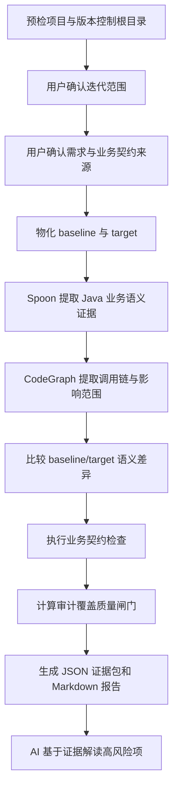

# code-change-check

[English README](README.en.md)

`code-change-check` 是面向 AI 生成代码的变更审查 Skill。它不要求逐行阅读全部实现，而是把迭代范围、需求、业务契约、Java 语义证据、调用链和 baseline/target 差异集中到一份可追溯报告中。

当前版本只对 **Java** 提供深度语义分析。

## 核心能力

- 支持 Git、SVN、目录快照和当前工作区。
- 交互选择本次迭代包含的提交或 SVN revision，支持方向键、空格多选、回车提交。
- 兼容 OpenSpec、spec-kit、superpowers、普通 Markdown 需求、设计和任务列表。
- 业务契约可来自指定文件、迭代前旧代码、两者同时使用或不使用。
- Spoon 在 `NOCLASSPATH` 模式下提取字段映射、调用参数、配置来源、HTTP 地址、数据库写入、权限条件和状态条件。
- CodeGraph 提取调用者、被调方法、影响范围和受影响测试。
- 自动比较 baseline/target，优先暴露“语法正确、运行不报错，但业务值来源或参数理解错误”的变化。
- 审计覆盖质量闸门明确区分 `success`、`partial` 和 `blocked`。

## 安装

仓库根目录本身就是可安装 Skill，必须保留根目录的 `SKILL.md`。

### Claude Code

将项目目录放入 Claude Code 的 Skill 目录，或使用 CC Switch：下载仓库 ZIP 后直接通过 CC Switch 导入安装 Skill。

### Codex

将项目目录放入 Codex Skills 目录，确保根目录 `SKILL.md` 可被发现。

### Cline

使用 [adapters/cline/code-change-check.md](adapters/cline/code-change-check.md) 或 [.clinerules/code-change-check.md](.clinerules/code-change-check.md) 作为规则入口。

建议每次审查前新开一个 Claude Code 或 Codex 对话。独立上下文可以降低“自己开发、自己审查”的上下文偏差，也不会分散原开发会话的注意力。

## 运行要求

- Python 3.10+。根目录启动器会检测 Python，缺失时给出明确提示。
- Java 17+。优先使用系统 Java；Windows 缺失时会自动下载并缓存固定版本运行时。
- 用户不需要安装 Maven、Gradle、Node.js、npm 或 CodeGraph。
- 首次下载运行时需要网络；使用 `--offline` 可禁止联网。

## 快速使用

Windows：

```powershell
run-code-change-check.cmd --project . --output code-change-check-output
```

macOS/Linux：

```bash
sh run-code-change-check.sh --project . --output code-change-check-output
```

在真实终端且未显式指定范围时，工具会进入交互流程。CI 或 AI 工具无 TTY 环境应先在聊天中确认范围和契约来源，再使用 `--no-interactive`。

常用命令：

```bash
# Git 范围
run-code-change-check.cmd --project . --base-ref main --target-ref HEAD --no-interactive

# SVN 范围
run-code-change-check.cmd --project . --svn-revision 100:120 --no-interactive

# 目录快照
run-code-change-check.cmd --project after --baseline before --no-interactive

# Java 分析必须成功
run-code-change-check.cmd --project . --scan-all --java-analysis required --no-interactive

# 离线运行
run-code-change-check.cmd --project . --scan-all --offline --no-interactive
```

Java 分析参数：

- `--java-analysis auto|required|off`
- `--tool-cache <目录>`
- `--offline`

## 工作流程



## 关键概念

| 名词 | 含义 |
|---|---|
| 迭代范围 | 本次审查包含的提交、revision、未提交改动或目录快照范围。 |
| baseline | 迭代开始前的代码状态，用于判断问题是否由本次改动引入。 |
| target | 本次迭代完成后的目标代码状态。 |
| 业务契约 | 字段含义、值来源、调用参数、寻址方式、权限条件、状态条件等必须保持的业务约束。 |
| 证据 | 支持审查结论的可追溯信息，包括文件、行号、语义槽位、值来源、调用链和差异。 |
| Spoon | 内置 Java AST 分析器，目标项目无需编译或解析完整依赖。 |
| CodeGraph | 调用链和影响范围辅助分析器，由 Skill 自动下载和管理。 |
| 覆盖质量闸门 | 判断分析证据是否足够支持结论。核心 Java 分析失败时为 `blocked`，部分能力缺失时为 `partial`。 |

## 输出

默认生成：

```text
code-change-check-output/
├── code-change-check-evidence.json
└── code-change-check-report.md
```

报告重点包含：

- Java 文件解析覆盖率与失败原因。
- 字段映射、参数、寻址、权限、状态和数据库写入差异。
- 调用链、影响范围和受影响测试。
- 业务契约检查结果。
- 必须人工核验的证据缺口。

## 开发

```bash
python -m unittest discover -s tests -p "test_*.py"
cd tools/java-analyzer && mvn test package
python scripts/build_release.py
```
